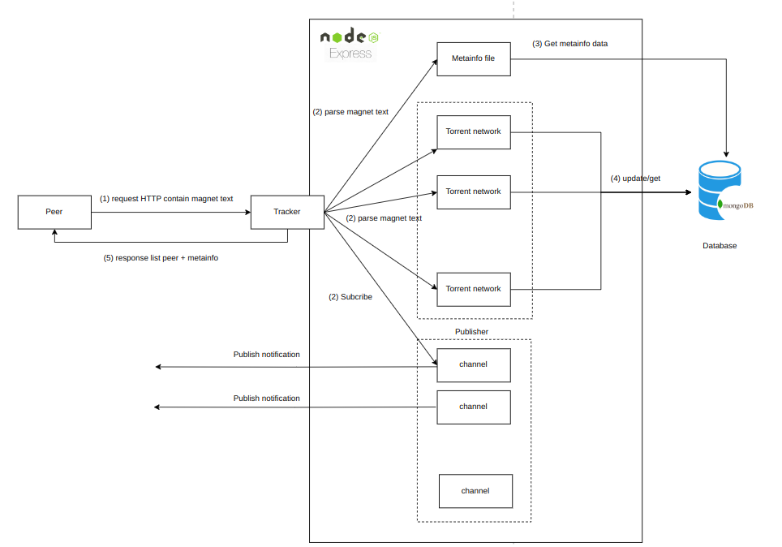

# Tracker Server

   

## Introduction

**Tracker Server** is a server for managing and tracking **torrent files** and **torrent networks**. It helps in tracking the status of torrents and facilitates data sharing and downloading through P2P (Peer-to-Peer) networks. This project provides a simple tracker server using Expess.js

### Key Features
- Manage and track multiple **torrent files**.
- Support for connecting and managing a **torrent network**.
- Handle **peer** and **seeder** requests from torrent clients.
- Support **Pub/Sub** mechanism to synchronize data between peers

## How everything work?

# Tracker Server Workflow
1. The user sends a request containing the contents of a metainfo file to the tracker.
2. The tracker stores the content and simultaneously hashes it into a magnet text, which is returned to the peer.
3. The peer then uses the magnet text to send a request to the tracker to join the torrent network.
4. The tracker receives the information, classifies the user into the corresponding torrent network, updates the network data, and returns a list of peers in the network to the user. At this point, the Sub/Pub model is formed between the peer and the tracker.
5. Whenever a new peer joins the network, the tracker will send the updated peer list to the peers in the network using the Sub/Pub mechanism.

